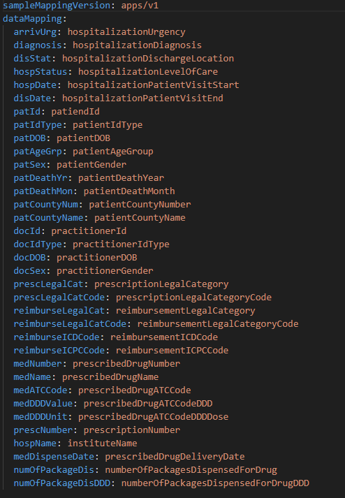

<h2 align="center">
  
</h2>

<h4 align="center">
    Accelerating translation from clinical research to tools
</h4>

## Data Wrangling:

It is used to convert data between CSV files and FHIR format. Conversion is a two-step process:

1. It uses the index file (resources/mapping.yaml) which holds the mapping details of the input CSV to the FHIR resources and it's respective attributes. Below is the screenshot of the mapping file for the dataset used to demonstrate SyntHIR. The key names of the mapping file are the header name of attributes of the input CSV file.



2. Populates the template of the FHIR resource (resources/FHIRResources/request-templates) with the values of the attributes from the CSV records.

### Component Configuration

To configure the following details to the properties file (application-prod.properties) in resources folder:

1. server.port=XXXX (Port on which the application will run)

### Steps to run the component

1. Using the Dockerfile of the component
   1. Build the image of the dockerfile using following steps :
      1. Start the docker daemon
      2. Cd to the root directory of the project (where is the dockerfile)
      3. Build using the command : docker build --tag 'data_wrangling_services:v1.0' .
         (Argument --tag indicates the repository name for the image (data_wrangling_services) and tag is v1.0)
   2. Run the docker image using the command : docker run -p 1234:8081 data_wrangling_services:v1.0
      (data_wrangling_services is the repository name of the docker image; 8081 is the port number on which the application is running in the container and 1234 is the port number mapped to 8081 port of the container)
2. Pull the docker image from docker hub and run it
   1. Docker image pull command : docker pull pavitra89/data_wrangling_services:v1.0
   2. Docker image run command : docker run -p 1234:8081 data_wrangling_services:v1.0

After running the component, the API can called be called using the hostname:portname followed by the API URL

### API details

1. Convert CSV to FHIR resources

   1. Request URL: http://hostname:port-number/api/v1/data-wrangling/convert/npr/csv-to-fhir
   2. Request Type: POST
   3. Request Body: Will have form-data. With CSV file in request param named "file".
   4. Response Body: Will be a list of JSON objects (Example of single JSON object from the list). Sample of JSON response is below:

   ```json
   [
     {
       "patient": {
         "resourceType": "Patient",
         "identifier": [
           {
             "use": "temp",
             "system": null,
             "value": "34579"
           }
         ],
         "name": null,
         "gender": "female",
         "birthDate": "1921",
         "deceasedBoolean": false,
         "deceasedDateTime": "2013-02",
         "address": [
           {
             "use": "",
             "city": "Hordaland Fylkeskommune",
             "district": "",
             "state": "",
             "postalCode": "12",
             "country": "Norway"
           }
         ],
         "extension": [
           {
             "valueString": "6"
           }
         ]
       },
       "practitioner": {
         "resourceType": "Practitioner",
         "identifier": [
           {
             "use": "temp",
             "system": null,
             "value": "42293"
           }
         ],
         "name": null,
         "gender": "male",
         "birthDate": "1952"
       },
       "location": {
         "resourceType": "Location",
         "identifier": null,
         "name": "Helse Bergen HF Haukeland",
         "mode": null,
         "address": null
       },
       "condition": {
         "resourceType": "Condition",
         "identifier": null,
         "code": {
           "coding": [
             {
               "code": "I49",
               "system": "http://hl7.org/fhir/sid/icd-10",
               "display": null
             }
           ],
           "text": "ICD-10 Codes"
         },
         "subject": {
           "reference": "",
           "identifier": {
             "use": null,
             "system": null,
             "value": ""
           },
           "display": "Patient associated with the condition",
           "type": "Patient"
         },
         "encounter": {
           "reference": "",
           "identifier": {
             "use": null,
             "system": null,
             "value": ""
           },
           "display": "Encounter associated with Patient",
           "type": "Encounter"
         }
       },
       "encounter": {
         "resourceType": "Encounter",
         "identifier": null,
         "status": "finished",
         "type": null,
         "subject": {
           "reference": "",
           "identifier": {
             "use": null,
             "system": null,
             "value": ""
           },
           "display": "Patient Hospitalized",
           "type": "Patient"
         },
         "location": [
           {
             "location": {
               "reference": "",
               "identifier": {
                 "use": null,
                 "system": null,
                 "value": ""
               },
               "display": "Institute Name where prescribed",
               "type": "Location"
             },
             "status": null
           }
         ],
         "hospitalization": {
           "dischargeDisposition": {
             "coding": [
               {
                 "code": "Other",
                 "system": "http://terminology.hl7.org/CodeSystem/discharge-disposition",
                 "display": null
               }
             ],
             "text": "Others"
           }
         },
         "period": {
           "start": "8/14/2013",
           "end": "8/14/2013"
         },
         "diagnosis": null,
         "participant": [
           {
             "individual": {
               "reference": "",
               "identifier": {
                 "use": null,
                 "system": null,
                 "value": ""
               },
               "display": "Practitioner Details for the patient hospitalized",
               "type": "Practitioner"
             }
           }
         ],
         "class": {
           "code": "PRENC",
           "system": "http://terminology.hl7.org/CodeSystem/v3-ActCode",
           "display": "Patient arrival mode for the Encounter"
         }
       },
       "medication": {
         "resourceType": "Medication",
         "identifier": [
           {
             "use": null,
             "system": null,
             "value": "267967"
           }
         ],
         "code": {
           "coding": [
             {
               "code": "C01AA04",
               "system": "http://www.whocc.no/atc",
               "display": null
             }
           ],
           "text": "Digimerck pico tab 0,05mg"
         }
       },
       "medicationRequest": {
         "resourceType": "MedicationRequest",
         "identifier": [
           {
             "use": null,
             "system": null,
             "value": "61526227"
           }
         ],
         "status": "unknown",
         "intent": "option",
         "category": [
           {
             "coding": [
               {
                 "code": "",
                 "system": null,
                 "display": null
               }
             ],
             "text": "Blåreseptordningen §§ 2, 3a, 3b, 4 og 5 (gammel ordning §§ 2, 3, 4, 9, og 10a)"
           }
         ],
         "medicationReference": {
           "reference": "",
           "identifier": {
             "use": null,
             "system": null,
             "value": ""
           },
           "display": "Medications for the prescription",
           "type": "Medication"
         },
         "subject": {
           "reference": "",
           "identifier": {
             "use": null,
             "system": null,
             "value": ""
           },
           "display": "Patient for the prescription",
           "type": "Patient"
         },
         "encounter": {
           "reference": "",
           "identifier": {
             "use": null,
             "system": null,
             "value": ""
           },
           "display": "Encounter associated with the prescription",
           "type": "Encounter"
         },
         "recorder": {
           "reference": "",
           "identifier": {
             "use": null,
             "system": null,
             "value": ""
           },
           "display": "Practitioner who prescribed the prescription",
           "type": "Practitioner"
         },
         "note": [
           {
             "authorString": "Legal Reimbursement category for the prescription",
             "text": "3"
           },
           {
             "authorString": "Legal Reimbursement code for the prescription",
             "text": "6"
           },
           {
             "authorString": "Reimbursement code for the prescription - ICD/ICPC",
             "text": "ICPC:K77"
           }
         ],
         "dosageInstruction": [
           {
             "text": "Defined daily dose of the drug",
             "doseAndRate": [
               {
                 "doseQuantity": {
                   "value": 0.1,
                   "unit": "mg"
                 },
                 "rateQuantity": {
                   "value": 0.0,
                   "unit": "Per Day"
                 }
               }
             ]
           }
         ]
       },
       "medicationDispense": {
         "resourceType": "MedicationDispense",
         "status": "unknown",
         "medicationReference": {
           "reference": "",
           "identifier": {
             "use": null,
             "system": null,
             "value": ""
           },
           "display": "Medication details for the dispense",
           "type": "Medication"
         },
         "subject": {
           "reference": "",
           "identifier": {
             "use": null,
             "system": null,
             "value": ""
           },
           "display": "Patient for the\r\nprescription",
           "type": "Patient"
         },
         "authorizingPrescription": [
           {
             "reference": "",
             "identifier": {
               "use": null,
               "system": null,
               "value": ""
             },
             "display": "Prescription for the Medication",
             "type": "MedicationRequest"
           }
         ],
         "quantity": {
           "value": 0.01,
           "unit": null
         },
         "daysSupply": {
           "value": 0.5,
           "unit": null
         },
         "whenHandedOver": "5/12/2014"
       }
     },
     {
       "patient": {
         "resourceType": "Patient",
         "identifier": [
           {
             "use": "temp",
             "system": null,
             "value": "34579"
           }
         ],
         "name": null,
         "gender": "female",
         "birthDate": "1921",
         "deceasedBoolean": false,
         "deceasedDateTime": "2013-02",
         "address": [
           {
             "use": "",
             "city": "Hordaland Fylkeskommune",
             "district": "",
             "state": "",
             "postalCode": "12",
             "country": "Norway"
           }
         ],
         "extension": [
           {
             "valueString": "6"
           }
         ]
       },
       "practitioner": {
         "resourceType": "Practitioner",
         "identifier": [
           {
             "use": "temp",
             "system": null,
             "value": "42293"
           }
         ],
         "name": null,
         "gender": "male",
         "birthDate": "1952"
       },
       "location": {
         "resourceType": "Location",
         "identifier": null,
         "name": "Helse Bergen HF Haukeland",
         "mode": null,
         "address": null
       },
       "condition": {
         "resourceType": "Condition",
         "identifier": null,
         "code": {
           "coding": [
             {
               "code": "I49",
               "system": "http://hl7.org/fhir/sid/icd-10",
               "display": null
             }
           ],
           "text": "ICD-10 Codes"
         },
         "subject": {
           "reference": "",
           "identifier": {
             "use": null,
             "system": null,
             "value": ""
           },
           "display": "Patient associated with the condition",
           "type": "Patient"
         },
         "encounter": {
           "reference": "",
           "identifier": {
             "use": null,
             "system": null,
             "value": ""
           },
           "display": "Encounter associated with Patient",
           "type": "Encounter"
         }
       },
       "encounter": {
         "resourceType": "Encounter",
         "identifier": null,
         "status": "finished",
         "type": null,
         "subject": {
           "reference": "",
           "identifier": {
             "use": null,
             "system": null,
             "value": ""
           },
           "display": "Patient Hospitalized",
           "type": "Patient"
         },
         "location": [
           {
             "location": {
               "reference": "",
               "identifier": {
                 "use": null,
                 "system": null,
                 "value": ""
               },
               "display": "Institute Name where prescribed",
               "type": "Location"
             },
             "status": null
           }
         ],
         "hospitalization": {
           "dischargeDisposition": {
             "coding": [
               {
                 "code": "Other",
                 "system": "http://terminology.hl7.org/CodeSystem/discharge-disposition",
                 "display": null
               }
             ],
             "text": "Others"
           }
         },
         "period": {
           "start": "8/14/2013",
           "end": "8/14/2013"
         },
         "diagnosis": null,
         "participant": [
           {
             "individual": {
               "reference": "",
               "identifier": {
                 "use": null,
                 "system": null,
                 "value": ""
               },
               "display": "Practitioner Details for the patient hospitalized",
               "type": "Practitioner"
             }
           }
         ],
         "class": {
           "code": "PRENC",
           "system": "http://terminology.hl7.org/CodeSystem/v3-ActCode",
           "display": "Patient arrival mode for the Encounter"
         }
       },
       "medication": {
         "resourceType": "Medication",
         "identifier": [
           {
             "use": null,
             "system": null,
             "value": "85944"
           }
         ],
         "code": {
           "coding": [
             {
               "code": "N02BE01",
               "system": "http://www.whocc.no/atc",
               "display": null
             }
           ],
           "text": "Panodil tab 1g"
         }
       },
       "medicationRequest": {
         "resourceType": "MedicationRequest",
         "identifier": [
           {
             "use": null,
             "system": null,
             "value": "54953344"
           }
         ],
         "status": "unknown",
         "intent": "option",
         "category": [
           {
             "coding": [
               {
                 "code": "",
                 "system": null,
                 "display": null
               }
             ],
             "text": "Normalresepter"
           }
         ],
         "medicationReference": {
           "reference": "",
           "identifier": {
             "use": null,
             "system": null,
             "value": ""
           },
           "display": "Medications for the prescription",
           "type": "Medication"
         },
         "subject": {
           "reference": "",
           "identifier": {
             "use": null,
             "system": null,
             "value": ""
           },
           "display": "Patient for the prescription",
           "type": "Patient"
         },
         "encounter": {
           "reference": "",
           "identifier": {
             "use": null,
             "system": null,
             "value": ""
           },
           "display": "Encounter associated with the prescription",
           "type": "Encounter"
         },
         "recorder": {
           "reference": "",
           "identifier": {
             "use": null,
             "system": null,
             "value": ""
           },
           "display": "Practitioner who prescribed the prescription",
           "type": "Practitioner"
         },
         "note": [
           {
             "authorString": "Legal Reimbursement category for the prescription",
             "text": "7"
           },
           {
             "authorString": "Legal Reimbursement code for the prescription",
             "text": ""
           },
           {
             "authorString": "Reimbursement code for the prescription - ICD/ICPC",
             "text": "ICPC:"
           }
         ],
         "dosageInstruction": [
           {
             "text": "Defined daily dose of the drug",
             "doseAndRate": [
               {
                 "doseQuantity": {
                   "value": 3.0,
                   "unit": "g"
                 },
                 "rateQuantity": {
                   "value": 0.0,
                   "unit": "Per Day"
                 }
               }
             ]
           }
         ]
       },
       "medicationDispense": {
         "resourceType": "MedicationDispense",
         "status": "unknown",
         "medicationReference": {
           "reference": "",
           "identifier": {
             "use": null,
             "system": null,
             "value": ""
           },
           "display": "Medication details for the dispense",
           "type": "Medication"
         },
         "subject": {
           "reference": "",
           "identifier": {
             "use": null,
             "system": null,
             "value": ""
           },
           "display": "Patient for the\r\nprescription",
           "type": "Patient"
         },
         "authorizingPrescription": [
           {
             "reference": "",
             "identifier": {
               "use": null,
               "system": null,
               "value": ""
             },
             "display": "Prescription for the Medication",
             "type": "MedicationRequest"
           }
         ],
         "quantity": {
           "value": 0.14,
           "unit": null
         },
         "daysSupply": {
           "value": 4.667,
           "unit": null
         },
         "whenHandedOver": "4/7/2014"
       }
     }
   ]
   ```

2. Convert FHIR resource list to CSV file

   1. Request URL: httphttp://localhost:XXXX/api/v1/data-wrangling/convert/npr/fhir-to-csv
   2. Request Type: POST
   3. Request Body: Will be a list of JSON objects. Example of JSON is given below:

   ```json
   [
     {
       "patient": {
         "resourceType": "Patient",
         "identifier": [
           {
             "use": "temp",
             "system": null,
             "value": "34579"
           }
         ],
         "name": null,
         "gender": "female",
         "birthDate": "1921",
         "deceasedBoolean": false,
         "deceasedDateTime": "2013-02",
         "address": [
           {
             "use": "",
             "city": "Hordaland Fylkeskommune",
             "district": "",
             "state": "",
             "postalCode": "12",
             "country": "Norway"
           }
         ],
         "extension": [
           {
             "valueString": "6"
           }
         ]
       },
       "practitioner": {
         "resourceType": "Practitioner",
         "identifier": [
           {
             "use": "temp",
             "system": null,
             "value": "42293"
           }
         ],
         "name": null,
         "gender": "male",
         "birthDate": "1952"
       },
       "location": {
         "resourceType": "Location",
         "identifier": null,
         "name": "Helse Bergen HF Haukeland",
         "mode": null,
         "address": null
       },
       "condition": {
         "resourceType": "Condition",
         "identifier": null,
         "code": {
           "coding": [
             {
               "code": "I49",
               "system": "http://hl7.org/fhir/sid/icd-10",
               "display": null
             }
           ],
           "text": "ICD-10 Codes"
         },
         "subject": {
           "reference": "",
           "identifier": {
             "use": null,
             "system": null,
             "value": ""
           },
           "display": "Patient associated with the condition",
           "type": "Patient"
         },
         "encounter": {
           "reference": "",
           "identifier": {
             "use": null,
             "system": null,
             "value": ""
           },
           "display": "Encounter associated with Patient",
           "type": "Encounter"
         }
       },
       "encounter": {
         "resourceType": "Encounter",
         "identifier": null,
         "status": "finished",
         "type": null,
         "subject": {
           "reference": "",
           "identifier": {
             "use": null,
             "system": null,
             "value": ""
           },
           "display": "Patient Hospitalized",
           "type": "Patient"
         },
         "location": [
           {
             "location": {
               "reference": "",
               "identifier": {
                 "use": null,
                 "system": null,
                 "value": ""
               },
               "display": "Institute Name where prescribed",
               "type": "Location"
             },
             "status": null
           }
         ],
         "hospitalization": {
           "dischargeDisposition": {
             "coding": [
               {
                 "code": "Other",
                 "system": "http://terminology.hl7.org/CodeSystem/discharge-disposition",
                 "display": null
               }
             ],
             "text": "Others"
           }
         },
         "period": {
           "start": "8/14/2013",
           "end": "8/14/2013"
         },
         "diagnosis": null,
         "participant": [
           {
             "individual": {
               "reference": "",
               "identifier": {
                 "use": null,
                 "system": null,
                 "value": ""
               },
               "display": "Practitioner Details for the patient hospitalized",
               "type": "Practitioner"
             }
           }
         ],
         "class": {
           "code": "PRENC",
           "system": "http://terminology.hl7.org/CodeSystem/v3-ActCode",
           "display": "Patient arrival mode for the Encounter"
         }
       },
       "medication": {
         "resourceType": "Medication",
         "identifier": [
           {
             "use": null,
             "system": null,
             "value": "267967"
           }
         ],
         "code": {
           "coding": [
             {
               "code": "C01AA04",
               "system": "http://www.whocc.no/atc",
               "display": null
             }
           ],
           "text": "Digimerck pico tab 0,05mg"
         }
       },
       "medicationRequest": {
         "resourceType": "MedicationRequest",
         "identifier": [
           {
             "use": null,
             "system": null,
             "value": "61526227"
           }
         ],
         "status": "unknown",
         "intent": "option",
         "category": [
           {
             "coding": [
               {
                 "code": "",
                 "system": null,
                 "display": null
               }
             ],
             "text": "Blåreseptordningen §§ 2, 3a, 3b, 4 og 5 (gammel ordning §§ 2, 3, 4, 9, og 10a)"
           }
         ],
         "medicationReference": {
           "reference": "",
           "identifier": {
             "use": null,
             "system": null,
             "value": ""
           },
           "display": "Medications for the prescription",
           "type": "Medication"
         },
         "subject": {
           "reference": "",
           "identifier": {
             "use": null,
             "system": null,
             "value": ""
           },
           "display": "Patient for the prescription",
           "type": "Patient"
         },
         "encounter": {
           "reference": "",
           "identifier": {
             "use": null,
             "system": null,
             "value": ""
           },
           "display": "Encounter associated with the prescription",
           "type": "Encounter"
         },
         "recorder": {
           "reference": "",
           "identifier": {
             "use": null,
             "system": null,
             "value": ""
           },
           "display": "Practitioner who prescribed the prescription",
           "type": "Practitioner"
         },
         "note": [
           {
             "authorString": "Legal Reimbursement category for the prescription",
             "text": "3"
           },
           {
             "authorString": "Legal Reimbursement code for the prescription",
             "text": "6"
           },
           {
             "authorString": "Reimbursement code for the prescription - ICD/ICPC",
             "text": "ICPC:K77"
           }
         ],
         "dosageInstruction": [
           {
             "text": "Defined daily dose of the drug",
             "doseAndRate": [
               {
                 "doseQuantity": {
                   "value": 0.1,
                   "unit": "mg"
                 },
                 "rateQuantity": {
                   "value": 0.0,
                   "unit": "Per Day"
                 }
               }
             ]
           }
         ]
       },
       "medicationDispense": {
         "resourceType": "MedicationDispense",
         "status": "unknown",
         "medicationReference": {
           "reference": "",
           "identifier": {
             "use": null,
             "system": null,
             "value": ""
           },
           "display": "Medication details for the dispense",
           "type": "Medication"
         },
         "subject": {
           "reference": "",
           "identifier": {
             "use": null,
             "system": null,
             "value": ""
           },
           "display": "Patient for the\r\nprescription",
           "type": "Patient"
         },
         "authorizingPrescription": [
           {
             "reference": "",
             "identifier": {
               "use": null,
               "system": null,
               "value": ""
             },
             "display": "Prescription for the Medication",
             "type": "MedicationRequest"
           }
         ],
         "quantity": {
           "value": 0.01,
           "unit": null
         },
         "daysSupply": {
           "value": 0.5,
           "unit": null
         },
         "whenHandedOver": "5/12/2014"
       }
     },
     {
       "patient": {
         "resourceType": "Patient",
         "identifier": [
           {
             "use": "temp",
             "system": null,
             "value": "34579"
           }
         ],
         "name": null,
         "gender": "female",
         "birthDate": "1921",
         "deceasedBoolean": false,
         "deceasedDateTime": "2013-02",
         "address": [
           {
             "use": "",
             "city": "Hordaland Fylkeskommune",
             "district": "",
             "state": "",
             "postalCode": "12",
             "country": "Norway"
           }
         ],
         "extension": [
           {
             "valueString": "6"
           }
         ]
       },
       "practitioner": {
         "resourceType": "Practitioner",
         "identifier": [
           {
             "use": "temp",
             "system": null,
             "value": "42293"
           }
         ],
         "name": null,
         "gender": "male",
         "birthDate": "1952"
       },
       "location": {
         "resourceType": "Location",
         "identifier": null,
         "name": "Helse Bergen HF Haukeland",
         "mode": null,
         "address": null
       },
       "condition": {
         "resourceType": "Condition",
         "identifier": null,
         "code": {
           "coding": [
             {
               "code": "I49",
               "system": "http://hl7.org/fhir/sid/icd-10",
               "display": null
             }
           ],
           "text": "ICD-10 Codes"
         },
         "subject": {
           "reference": "",
           "identifier": {
             "use": null,
             "system": null,
             "value": ""
           },
           "display": "Patient associated with the condition",
           "type": "Patient"
         },
         "encounter": {
           "reference": "",
           "identifier": {
             "use": null,
             "system": null,
             "value": ""
           },
           "display": "Encounter associated with Patient",
           "type": "Encounter"
         }
       },
       "encounter": {
         "resourceType": "Encounter",
         "identifier": null,
         "status": "finished",
         "type": null,
         "subject": {
           "reference": "",
           "identifier": {
             "use": null,
             "system": null,
             "value": ""
           },
           "display": "Patient Hospitalized",
           "type": "Patient"
         },
         "location": [
           {
             "location": {
               "reference": "",
               "identifier": {
                 "use": null,
                 "system": null,
                 "value": ""
               },
               "display": "Institute Name where prescribed",
               "type": "Location"
             },
             "status": null
           }
         ],
         "hospitalization": {
           "dischargeDisposition": {
             "coding": [
               {
                 "code": "Other",
                 "system": "http://terminology.hl7.org/CodeSystem/discharge-disposition",
                 "display": null
               }
             ],
             "text": "Others"
           }
         },
         "period": {
           "start": "8/14/2013",
           "end": "8/14/2013"
         },
         "diagnosis": null,
         "participant": [
           {
             "individual": {
               "reference": "",
               "identifier": {
                 "use": null,
                 "system": null,
                 "value": ""
               },
               "display": "Practitioner Details for the patient hospitalized",
               "type": "Practitioner"
             }
           }
         ],
         "class": {
           "code": "PRENC",
           "system": "http://terminology.hl7.org/CodeSystem/v3-ActCode",
           "display": "Patient arrival mode for the Encounter"
         }
       },
       "medication": {
         "resourceType": "Medication",
         "identifier": [
           {
             "use": null,
             "system": null,
             "value": "85944"
           }
         ],
         "code": {
           "coding": [
             {
               "code": "N02BE01",
               "system": "http://www.whocc.no/atc",
               "display": null
             }
           ],
           "text": "Panodil tab 1g"
         }
       },
       "medicationRequest": {
         "resourceType": "MedicationRequest",
         "identifier": [
           {
             "use": null,
             "system": null,
             "value": "54953344"
           }
         ],
         "status": "unknown",
         "intent": "option",
         "category": [
           {
             "coding": [
               {
                 "code": "",
                 "system": null,
                 "display": null
               }
             ],
             "text": "Normalresepter"
           }
         ],
         "medicationReference": {
           "reference": "",
           "identifier": {
             "use": null,
             "system": null,
             "value": ""
           },
           "display": "Medications for the prescription",
           "type": "Medication"
         },
         "subject": {
           "reference": "",
           "identifier": {
             "use": null,
             "system": null,
             "value": ""
           },
           "display": "Patient for the prescription",
           "type": "Patient"
         },
         "encounter": {
           "reference": "",
           "identifier": {
             "use": null,
             "system": null,
             "value": ""
           },
           "display": "Encounter associated with the prescription",
           "type": "Encounter"
         },
         "recorder": {
           "reference": "",
           "identifier": {
             "use": null,
             "system": null,
             "value": ""
           },
           "display": "Practitioner who prescribed the prescription",
           "type": "Practitioner"
         },
         "note": [
           {
             "authorString": "Legal Reimbursement category for the prescription",
             "text": "7"
           },
           {
             "authorString": "Legal Reimbursement code for the prescription",
             "text": ""
           },
           {
             "authorString": "Reimbursement code for the prescription - ICD/ICPC",
             "text": "ICPC:"
           }
         ],
         "dosageInstruction": [
           {
             "text": "Defined daily dose of the drug",
             "doseAndRate": [
               {
                 "doseQuantity": {
                   "value": 3.0,
                   "unit": "g"
                 },
                 "rateQuantity": {
                   "value": 0.0,
                   "unit": "Per Day"
                 }
               }
             ]
           }
         ]
       },
       "medicationDispense": {
         "resourceType": "MedicationDispense",
         "status": "unknown",
         "medicationReference": {
           "reference": "",
           "identifier": {
             "use": null,
             "system": null,
             "value": ""
           },
           "display": "Medication details for the dispense",
           "type": "Medication"
         },
         "subject": {
           "reference": "",
           "identifier": {
             "use": null,
             "system": null,
             "value": ""
           },
           "display": "Patient for the\r\nprescription",
           "type": "Patient"
         },
         "authorizingPrescription": [
           {
             "reference": "",
             "identifier": {
               "use": null,
               "system": null,
               "value": ""
             },
             "display": "Prescription for the Medication",
             "type": "MedicationRequest"
           }
         ],
         "quantity": {
           "value": 0.14,
           "unit": null
         },
         "daysSupply": {
           "value": 4.667,
           "unit": null
         },
         "whenHandedOver": "4/7/2014"
       }
     }
   ]
   ```

   4. Response Body: CSV file
